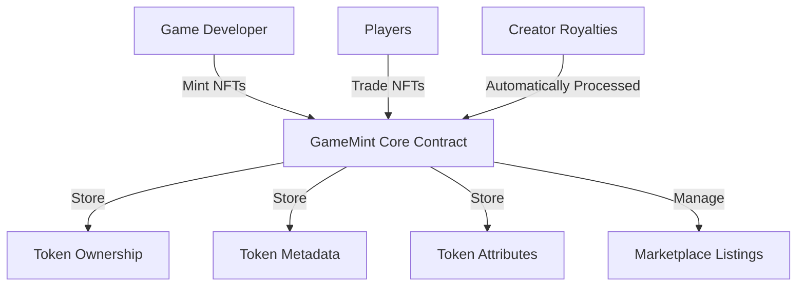

# GameMint NFT Platform

A comprehensive platform for creating, managing, and trading in-game items as NFTs on the Stacks blockchain.

## Overview

GameMint provides game developers and players with a standardized framework for representing game assets as non-fungible tokens. The platform supports:

- Custom game-specific attributes (rarity, level, power stats)
- Built-in royalty mechanisms for creators
- Secondary market trading
- Batch minting capabilities
- Attribute updating for dynamic game items

## Architecture

The GameMint platform is built around a core smart contract that handles all NFT operations and marketplace functionality.



### Core Components

- Token Management
- Ownership Tracking
- Metadata Storage
- Game-specific Attributes
- Marketplace Functions
- Royalty Distribution
- Access Control

## Contract Documentation

### gamemint-core.clar

The main contract handling all NFT operations and marketplace functionality.

#### Key Features:

- NFT minting with custom attributes
- Ownership management
- Marketplace integration
- Royalty processing
- Creator authorization system
- Pausable functionality

#### Access Control Levels:

- Contract Owner: Full administrative control
- Authorized Creators: Minting and attribute updates
- Token Owners: Transfer and listing control
- General Users: Token purchases

## Getting Started

### Prerequisites

- Clarinet
- Stacks wallet
- STX tokens for transactions

### Installation

1. Clone the repository
2. Install dependencies with Clarinet
3. Deploy the contract to the desired network

```bash
clarinet deploy
```

## Function Reference

### Token Management

```clarity
(mint-nft (name string-ascii) (description string-ascii) (image-uri string-utf8) 
          (game-id string-ascii) (royalty-percentage uint) (rarity string-ascii) 
          (level uint) (stats list) (custom-attributes list) (recipient principal))
```

```clarity
(batch-mint-nft (count uint) (name-prefix string-ascii) ... (recipient principal))
```

### Marketplace Operations

```clarity
(list-token (token-id uint) (price uint) (expiry uint))
(buy-token (token-id uint))
(cancel-listing (token-id uint))
```

### Token Updates

```clarity
(update-token-metadata (token-id uint) (name string-ascii) 
                      (description string-ascii) (image-uri string-utf8))
```

```clarity
(update-token-attributes (token-id uint) (rarity string-ascii) 
                        (level uint) (stats list) (custom-attributes list))
```

## Development

### Testing

Run the test suite using Clarinet:

```bash
clarinet test
```

### Local Development

1. Start a local Clarinet console:
```bash
clarinet console
```

2. Test contract functions:
```clarity
(contract-call? .gamemint-core mint-nft ...)
```

## Security Considerations

### Limitations

- Maximum royalty percentage of 20%
- Batch minting limited to 100 tokens
- Contract pausable for emergency situations

### Best Practices

1. Always verify token ownership before transactions
2. Check listing expiration before purchases
3. Validate royalty percentages are within limits
4. Ensure sufficient STX balance for purchases
5. Verify authorized creator status before minting

### Important Security Points

- Ownership validation on all transfer operations
- Royalty payments automatically enforced
- Access control checks on administrative functions
- Pause mechanism for emergency situations
- Creator authorization system for minting rights